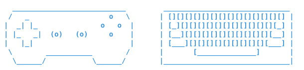

# teleop2servo

[](https://opensource.org/licenses/Apache-2.0)
[](https://github.com/pre-commit/pre-commit)
[](https://github.com/j178/prek)

<p align="center">
    
    
</p>


ROS 2 teleoperation node for controlling a robot using MoveIt Servo with various input devices.

`teleop2servo` turns user input into `control_msgs/JointJog` (joint control) and `geometry_msgs/TwistStamped` (Cartesian control) commands for MoveIt Servo. It can optionally switch the `ros2_control` controllers and start Servo for you when you begin teleoperation, and restore them when you finish.

## Features

- **Two input devices:** a terminal keyboard (no extra drivers) and a gamepad (via the [`joy`](https://index.ros.org/p/joy/) package). Ready to extend and add different input devices.
- **Three control modes:** `JOINT` (single joints), `BASE` (Cartesian, base frame) and `TOOL` (Cartesian, end-effector frame).
- **Speed modes:** `STEP` (one fixed step per press) and continuous `CONT` at 5 / 10 / 25 / 50 / 75 / 100 % of the configured maximum.
- **Safe by default:** the device starts **blocked** and has to be unblocked explicitly; blocking it again stops the motion immediately.
- **Optional Servo activation:** on unblock, switch controllers and call `start_servo`; on block or Ctrl+C, stop Servo and restore the original controllers.
- **Go home:** one button moves the robot to a joint position set in the YAML, planned and executed by MoveIt.
- **Gripper control:** one key (gamepad `A`, keyboard `g`) opens / closes the gripper through a `control_msgs/action/GripperCommand` action.
- **Terminal UI:** live status (blocked/ready, mode, speed) and the controls for the current mode.

## Requirements

- ROS 2 **Humble**
- A running **MoveIt Servo** node configured for your robot
- For the gamepad: the [`joy`](https://index.ros.org/p/joy/) package and a connected controller
- For automatic Servo activation: a robot driven by `ros2_control` (`controller_manager`)

## Installation

```bash
cd ~/ceai_ws/src
git clone https://github.com/AGH-CEAI/teleop2servo.git
cd ~/ceai_ws
rosdep install --from-paths src/teleop2servo --ignore-src -y
colcon build --symlink-install --packages-select teleop2servo
source install/setup.bash
```

## Quick start

1. Start your robot and MoveIt Servo.
2. Launch teleop with the device of your choice:

   ```bash
   # keyboard (default) – keep the terminal focused while driving
   ros2 launch teleop2servo teleop.launch.py teleop_device:=keyboard

   # gamepad – starts joy_node and the teleop node in one container
   ros2 launch teleop2servo teleop.launch.py teleop_device:=gamepad
   ```

3. Unblock the device (see [Controls](#controls)) and drive.
4. Press **Ctrl+C** to exit.

To run a node directly with your own parameters:

```bash
ros2 run teleop2servo teleop_keyboard_node --ros-args --params-file ~/ceai_ws/src/teleop2servo/teleop2servo/config/teleop_keyboard.yaml
ros2 run teleop2servo teleop_gamepad_node_exec --ros-args --params-file ~/ceai_ws/src/teleop2servo/teleop2servo/config/teleop_gamepad.yaml  # needs joy_node
```

## Controls

The current controls are always printed in the terminal; the tables below are a reference.

## MoveIt Servo activation

With `servo_activation.enabled: true` the node manages Servo for you:

| Event                   | Action                                                                                          |
| ----------------------- | ----------------------------------------------------------------------------------------------- |
| Device unblocked        | switch controllers (`deactivate_controllers` → `activate_controllers`), then call `start_servo` |
| Device blocked / Ctrl+C | call `stop_servo`, then switch the controllers back                                             |

If a service is unavailable or fails, the device stays blocked and the error is shown in the terminal. Set `enabled: false` if Servo and the controllers are managed elsewhere. To skip a single step, set its service name to `""`.

Example for a UR robot (Servo publishing to `/forward_position_controller/commands`):

```yaml
servo_activation:
  enabled: true
  switch_controller_service: "/controller_manager/switch_controller"
  activate_controllers: ["forward_position_controller"]
  deactivate_controllers: ["scaled_joint_trajectory_controller"]
  start_servo_service: "/servo_node/start_servo"
  stop_servo_service: "/servo_node/stop_servo"
```

Use `ros2 control list_controllers` to see which controllers your robot provides and which one Servo's `command_out_topic` points to.

## Go home

Press **`[>]`** (right arrow next to ON) on the gamepad or **`?`** on the keyboard while the device is unblocked:

1. Motion stops, Servo is stopped and the initial controllers are restored (as on block, see [MoveIt Servo activation](#moveit-servo-activation)).
2. A `moveit_msgs/action/MoveGroup` goal with joint constraints for `go_home.joint_positions` is sent to `move_group`, which plans and executes the move (the same as `RobotDirector.joint_move()` in [aegis_ros](https://github.com/AGH-CEAI/aegis_ros)).
3. When the move finishes (or fails), Servo is activated again and teleoperation continues.

While homing the status shows `HOMING` and motion input is ignored. Blocking the device (`B` / `*`) cancels the move. Requires a running `move_group`.

```yaml
go_home:
  enabled: true
  server_timeout_s: 2.0
  move_group_action: "/move_action"
  planning_group: "aegis_arm"
  joint_positions: [0.0, -2.094395, 2.094395, -1.570796, -1.570796, 0.0]  # [rad], order of joint_names
  joint_tolerance: 0.001
  max_velocity_scaling: 0.1
  max_acceleration_scaling: 0.1
  planning_time_s: 5.0
```

## Gripper control

With `gripper.enabled: true`, gamepad `A` or keyboard `g` toggles the gripper between `open_position` and `close_position`.

Example for the [Robotiq Hand-E](https://github.com/AGH-CEAI/robotiq_hande_driver) (finger joint, 0.025 m = fully open):

```yaml
gripper:
  enabled: true
  action_name: "/gripper_action_controller/gripper_cmd"
  open_position: 0.025
  close_position: 0.0   # e.g. 0.01 to stop at a 2 cm gap
  max_effort: 0.0
```

## ROS interface

| Type                      | Name (default)                                      | Message / service                              |
| ------------------------- | --------------------------------------------------- | ---------------------------------------------- |
| Publisher                 | `/servo_node/delta_joint_cmds`                      | `control_msgs/msg/JointJog`                    |
| Publisher                 | `/servo_node/delta_twist_cmds`                      | `geometry_msgs/msg/TwistStamped`               |
| Subscriber (gamepad)      | `/joy`                                              | `sensor_msgs/msg/Joy`                          |
| Service client (optional) | `/controller_manager/switch_controller`             | `controller_manager_msgs/srv/SwitchController` |
| Service client (optional) | `/servo_node/start_servo`, `/servo_node/stop_servo` | `std_srvs/srv/Trigger`                         |
| Action client (optional)  | `/move_action`                                      | `moveit_msgs/action/MoveGroup`                 |
| Action client (optional)  | `/gripper_action_controller/gripper_cmd`            | `control_msgs/action/GripperCommand`           |

## Parameters

Default configurations: [`config/teleop_keyboard.yaml`](teleop2servo/config/teleop_keyboard.yaml) and [`config/teleop_gamepad.yaml`](teleop2servo/config/teleop_gamepad.yaml).

### Common

| Parameter                               | Default                    | Description                                             |
| --------------------------------------- | -------------------------- | ------------------------------------------------------- |
| `servo_publish_hz`                      | `250.0`                    | Command publishing rate                                 |
| `servo_ticks_per_policy_step`           | `10`                       | Number of publish ticks a single `STEP` lasts           |
| `twist_topic` / `joint_topic`           | `/servo_node/delta_*_cmds` | Servo input topics                                      |
| `queue_size`                            | `10`                       | Publisher queue size                                    |
| `base_frame_id` / `ee_frame_id`         | `base_link` / `tool0`      | Frames for `BASE` and `TOOL` modes                      |
| `joint_names`                           | UR joint names             | Joints commanded in `JOINT` mode                        |
| `joint_vel_step` / `joint_vel_cont_max` | `0.1` / `0.8`              | Joint command in `STEP` / at `CONT 100%`                |
| `twist_lin_step` / `twist_lin_cont_max` | `0.1` / `0.5`              | Linear command in `STEP` / at `CONT 100%`               |
| `twist_ang_step` / `twist_ang_cont_max` | `0.1` / `0.8`              | Angular command in `STEP` / at `CONT 100%`              |
| `servo_activation.*`                    | `enabled: true`            | See [MoveIt Servo activation](#moveit-servo-activation) |
| `go_home.*`                             | `enabled: true`            | See [Go home](#go-home)                                 |
| `gripper.*`                             | `enabled: true`            | See [Gripper control](#gripper-control)                 |

Velocity values are normalized commands, scaled by Servo's `scale.*` parameters.

### Keyboard

| Parameter               | Default | Description                                         |
| ----------------------- | ------- | --------------------------------------------------- |
| `reading_keyboard_hz`   | `250.0` | Keyboard polling rate                               |
| `key_initial_timeout_s` | `0.55`  | Must be greater than the system key-repeat delay    |
| `key_repeat_timeout_s`  | `0.1`   | Must be greater than the system key-repeat interval |

### Gamepad

| Parameter   | Default | Description                 |
| ----------- | ------- | --------------------------- |
| `joy_topic` | `/joy`  | Input topic from `joy_node` |

## Keyboard notes

- The keyboard node reads the controlling terminal (`/dev/tty`), so the terminal must have focus.
- Terminals report no key-release events. A key counts as released when no auto-repeat arrives within the timeouts above, so motion in `CONT` stops about 0.5 s after a short tap.
- Only one key is handled at a time.
- Keys are case-insensitive and the state keys are `*` (block / unblock), `Tab` (mode) and `` ` `` (speed), so Caps Lock doesn't affect control.
- If motion stutters while a key is held, check your key-repeat settings (on GNOME: `gsettings get org.gnome.desktop.peripherals.keyboard delay` and `repeat-interval`) and adjust the timeouts.

## Development notes

This project uses various tools for aiding the quality of the source code. Currently most of them are executed by the `pre-commit`. As a faster alternative it is suggested to use `prek`. Please make sure to enable its hooks:

```bash
# In case of pre-commit
pre-commit install
# In case of prek
prek install
```

## License

This repository is licensed under the Apache 2.0, see LICENSE for details.
